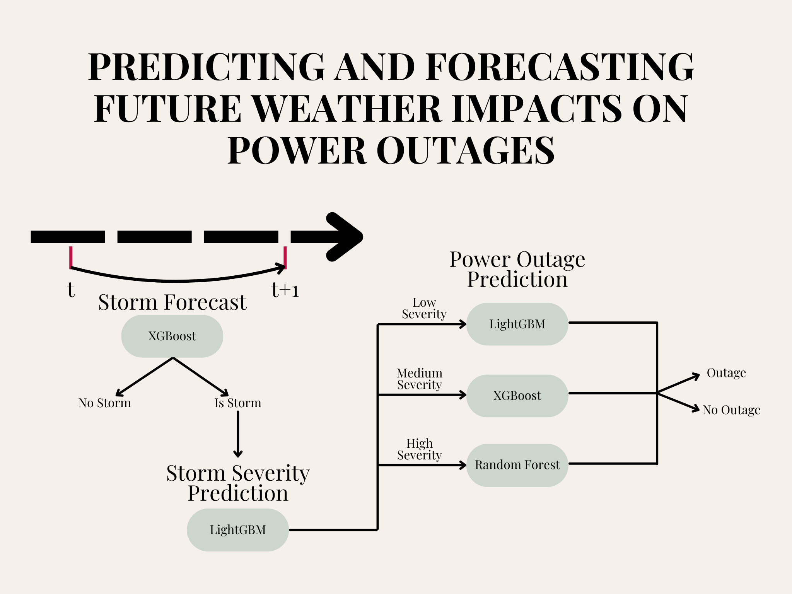

# StormShield: Predictive Power Outage Forecasting

## Overview

StormShield is a machine learning-based project designed to predict storm severity and associated power outages using real-world meteorological and outage data. The project integrates datasets from sources like NOAA, Eaglei, and PRISM, processes them through a robust pipeline, and employs advanced models (Random Forest, LightGBM, and Feedforward Neural Networks) to provide accurate forecasts. This solution aims to enhance disaster preparedness and response by identifying patterns in weather events and their impact on power infrastructure.



## Features

- **Data Preprocessing**: Cleans, merges, and transforms raw data into a usable format.
- **Feature Engineering**: Incorporates lagged storm indicators to improve prediction accuracy.
- **Multi-Model Prediction**: Utilizes Random Forest, LightGBM, and FNN for storm occurrence, severity classification, and outage prediction.
- **Automation**: Includes scripts to streamline data processing and model training.
- **Documentation**: Provides clear instructions and requirements for setup and usage.

## Installation

### Prerequisites

- Python 3.11 or later
- Git (for cloning the repository)

### Setup

1. Clone the repository:
   ```bash
   git clone https://github.com/your-username/StormShield.git
   cd StormShield
   ```
2. Install the required dependencies:
   ```bash
   pip install -r requirements.txt
   ```
3. Ensure the raw data files (`01_raw_data.txt`) are placed in the `data` directory or update the file paths in the preprocessing notebooks accordingly.

## Usage

### Workflow

1. **Data Preprocessing**:

   - Run the preprocessing notebooks in sequence:
     - `preprocessing/01_load_clean_merge_data.ipynb`: Loads and merges raw data.
     - `preprocessing/02_lag_feature_engineering.ipynb`: Adds lagged features and finalizes the dataset.
   - Output files (`02_interim_processed_data.txt` and `03_processed_data_final.txt`) will be generated in the `data` directory.
2. **Model Training and Prediction**:

   - Execute `models/storm_severity_outage_predict.ipynb` to train and evaluate the models using the processed data.
   - This notebook handles storm prediction, severity classification, and outage forecasting with tuned hyperparameters.

## File Structure

```
StormShield/
├── data/
│   ├── 01_raw_data.txt         # Raw input data
│   ├── 02_interim_processed_data.txt  # Intermediate processed data
│   └── 03_processed_data_final.txt    # Final processed dataset
├── models/
│   └── storm_severity_outage_predict.ipynb  # Model training and evaluation notebook
├── preprocessing/
│   ├── 01_load_clean_merge_data.ipynb  # Data loading and merging
│   └── 02_lag_feature_engineering.ipynb  # Feature engineering with lag analysis
├── README.md               # Project documentation
└── requirements.txt        # Dependency list
```

## Dependencies

The project relies on the following Python packages (listed in `requirements.txt`):

- `pandas>=2.0.0`
- `scikit-learn>=1.2.0`
- `xgboost>=1.7.0`
- `lightgbm>=3.3.0`
- `tensorflow>=2.15.0`
- `nltk>=3.8.0`
- `optuna>=3.3.0`
- `matplotlib>=3.7.0`
- `numpy>=1.23.0`

## Contributing

Contributions are welcome! To contribute:

1. Fork the repository.
2. Create a new branch (`git checkout -b feature/your-feature`).
3. Make your changes and commit them (`git commit -m "Add your message"`).
4. Push to the branch (`git push origin feature/your-feature`).
5. Open a pull request with a clear description of your changes.
